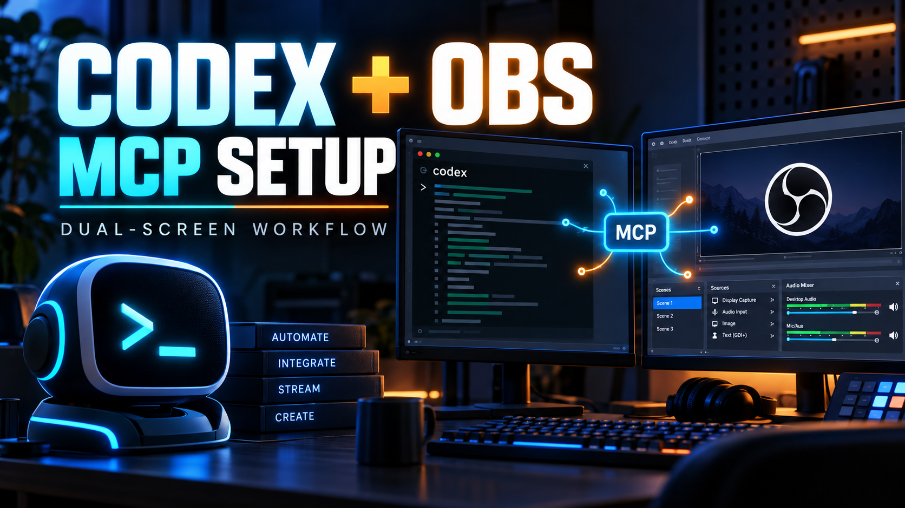

# codex-obs-skill

Codex skill for configuring a local OBS Studio MCP server and safely creating, validating, and recovering dual-screen OBS scenes.

## Contents

- `SKILL.md` — routing and operating contract
- `references/mcp-setup.md` — OBS MCP installation and Codex configuration
- `references/dual-screen-operations.md` — PipeWire, dual-screen layout, camera privacy, and live-recording safety
- `scripts/diagnose_obs_mcp.sh` — read-only local diagnostics
